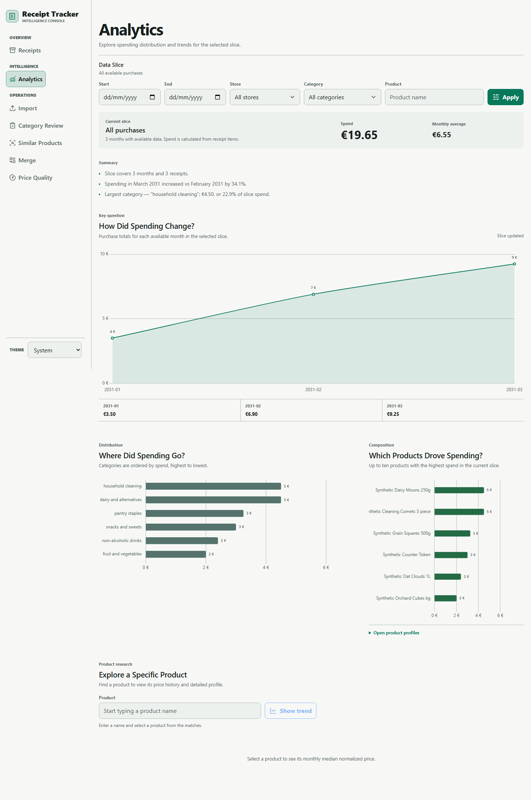
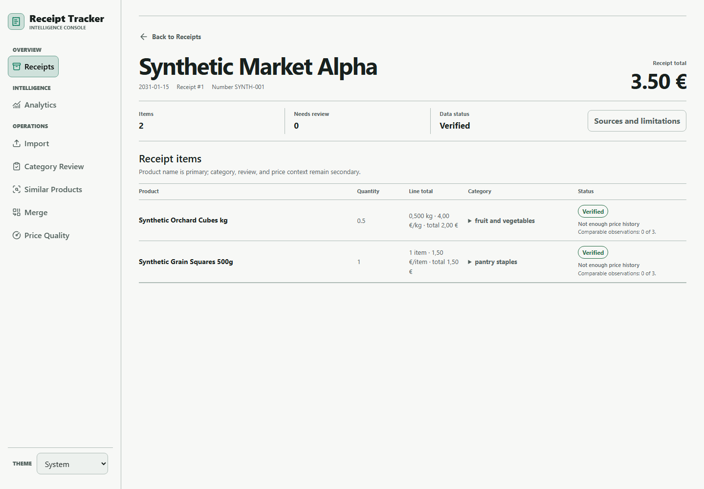
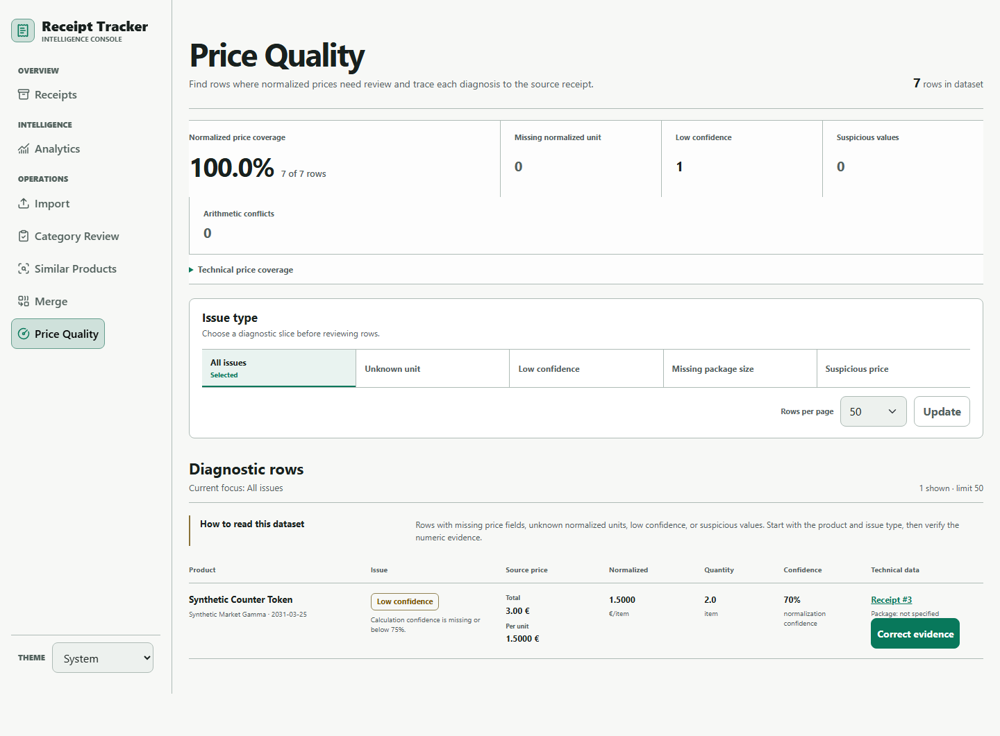

# Receipt Intelligence — Retail Receipt Analytics Pipeline

Local Flask and SQLite pipeline for turning grocery-receipt PDFs into reviewable household-spend data.

## Problem and pipeline

Receipt PDFs are inconsistent, but can answer questions about monthly spend, categories, recurring products, and comparable prices. The app imports PDFs, parses receipt/items into SQLite, normalizes names for matching, applies category rules, derives price evidence, and provides analytics, product dossiers, review/merge workspaces, and price-quality diagnostics.

## Architecture and data model

- `app/db.py`: schema, connections, and insertion.
- `app/receipt_parser.py` and `app/importer.py`: parsing/import.
- `app/price_model.py`: evidence-based price derivation.
- `app/product_identity.py`: canonical-or-raw reporting identity.
- `app/web/`: Flask routes, templates, and assets.

`receipts` stores date, store, total, and number. `items` stores receipt-linked identity, category, quantity, paid total, and price evidence. `product_category_rules` stores category decisions. `price` and `line_total` are paid totals; normalized prices exist only for compatible known units.

## Normalization and price quality

Normalized names help matching but never automatically merge products. Reporting uses a deliberate nonblank `canonical_name`, otherwise the receipt name. The price model accepts consistent parser, package, or guarded weighted evidence and leaves ambiguous multipacks, service lines, malformed values, and low-confidence evidence unresolved.

## Analytics and privacy

[Analysis queries](analysis/queries.sql) cover monthly/category spend, normalized store evidence and history, recurring products, and price-evidence coverage. Review with synthetic data only: keep real receipt PDFs, personal databases, exports, and screenshots out of public releases.

## Synthetic-data screenshots

All three views below were rendered from `sample_data/receipts.json`; they contain no production receipt data.







## Synthetic quick start

`create_app()` runs schema setup. Set `RECEIPT_DB_PATH` before startup so it uses the synthetic database.

```powershell
python -m venv .venv
.\.venv\Scripts\Activate.ps1
python -m pip install -r requirements.txt
$env:RECEIPT_DB_PATH = "tmp/public-sample/receipts.db"
python -m app.create_sample_db --output $env:RECEIPT_DB_PATH
python run.py
```

## Tests

```powershell
$env:RECEIPT_DB_PATH = "tmp/public-sample/receipts.db"
python -m unittest tests.test_sample_data -v
python -m unittest discover -v
```

## Limitations

Local-only: no authentication, cloud hosting, or publication workflow. Parsing depends on source layouts; unresolved evidence intentionally has no normalized comparison. Canonical grouping requires deliberate user action.

## Project structure

```text
app/          application, parser, SQLite, analytics
analysis/     reusable SQLite queries
sample_data/  synthetic fixture
tests/        unittest coverage
docs/         architecture and database notes
```
