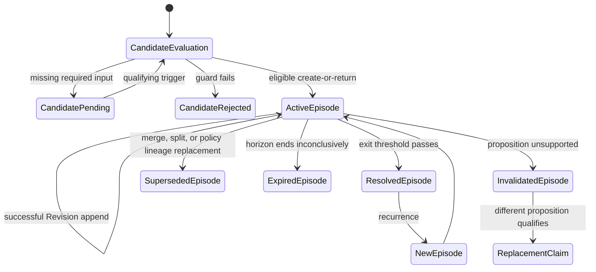
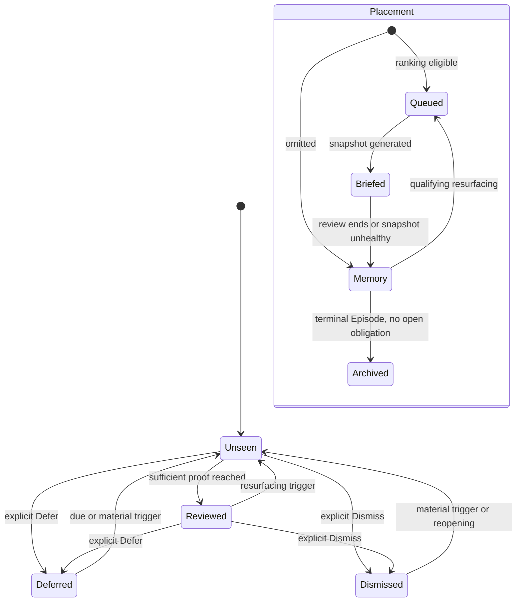
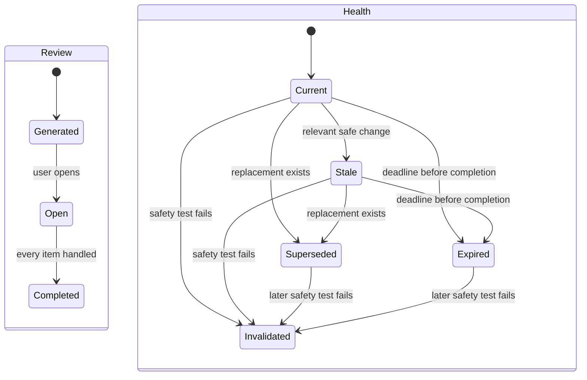
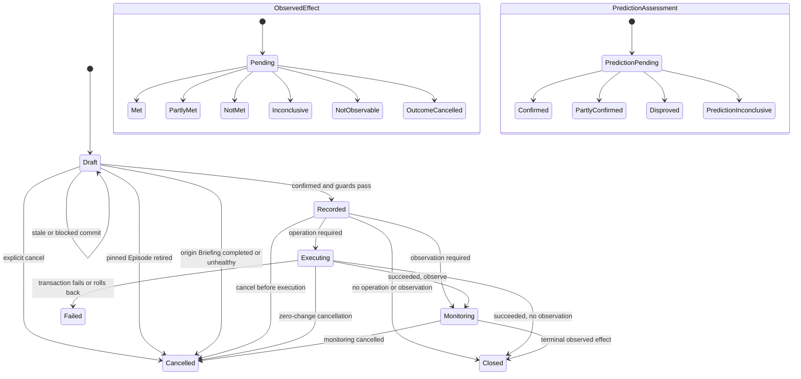
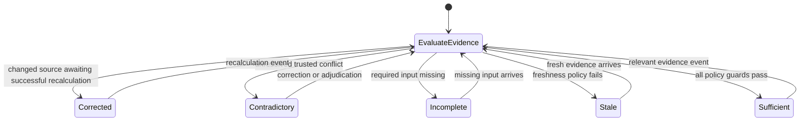

# Receipt Intelligence OS — Interaction Specification

**Status:** Canonical behavior specification, MVP contract frozen  
**Authority:** Subordinate only to the approved Product Constitution  
**Scope:** Product behavior across desktop, tablet, and mobile  
**Excludes:** Visual styling, implementation code, database schema, and implementation planning

## 1. Scope and Implementation Boundary

The first implementation is local, single-user, Flask/Jinja, synchronous, backed by one active database, and limited to deterministic rules-based Claims. It has no AI-generated Claims, household collaboration, distributed services, cross-device synchronization, or asynchronous workflow engine.

This boundary is normative. Every MVP behavior in this document MUST be deterministic under one local application process with normal browser-tab concurrency. Future capabilities may extend owner scope, generators, and coordination, but MUST preserve Claim truth, evidence provenance, revision lineage, and historical immutability.

The Product Constitution remains unchanged. Briefing is the opening ritual. Claim is the product primitive. Trace the Claim is the universal explanation model. Decision, Outcome, Memory, and Quiet Mode retain their approved meanings.

## 2. Normative Language and Terminology

**MUST** is required. **SHOULD** is the deterministic default unless an accessibility or platform constraint requires equivalent behavior. **MAY** is optional and cannot weaken a MUST.

Canonical terms:

- **Candidate:** ephemeral or derived pre-Claim eligibility evaluation.
- **Claim:** durable logical proposition and scope.
- **Episode:** one contiguous validity interval for a Claim.
- **Revision:** immutable evaluation of one Episode against one evidence snapshot.
- **Evidence snapshot:** immutable membership and interpretation record supporting one Revision.
- **Briefing:** immutable ranked snapshot of Claim Revisions and stability evidence.
- **Decision:** explicit user choice pinned to a Claim Revision.
- **Outcome:** execution result, observed effect, or prediction assessment linked to a Decision.
- **Memory:** product layer and Placement, not a Claim truth state.

NEW, ONGOING, and RESOLVED are canonical internal memory states computed from Episode validity and surfacing history rather than independently mutated fields. NEW means the current Episode has not previously been surfaced. ONGOING means it was surfaced and remains ACTIVE. RESOLVED means a surfaced Episode is terminal: validity may be RESOLVED, INVALIDATED, SUPERSEDED, or EXPIRED, and a stored resolution-reason subtype preserves that distinction. `POTENTIAL`, `MEMORY_ONLY`, and `IGNORED` are not canonical states. **Dismiss** replaces the former Ignore behavior. **No action** is an explicit Decision and is never inferred from inactivity. **Investigate** is a constitutional Decision intent fulfilled by entering Investigation; it does not create a persisted Decision record unless the user later makes one of the persisted Decision types. User confirmation belongs only to Decisions, never Claim creation.

## 3. Canonical Product Loop and Objects

The product loop is:

**Import → Normalize → Evaluate Candidate → Create or Revise Claim → Explain → Show Evidence → Decision → Outcome → Learning → Future Briefing**

An imported source creates Facts and operational Events. Normalization maps those Facts to products, merchants, quantities, units, categories, and periods while preserving uncertainty. Candidate evaluation applies deterministic, versioned rules. An eligible Candidate creates or revises a Claim automatically. Trace exposes reasoning and evidence. A user may make a Decision. Execution or later evidence may produce Outcomes. Outcomes inform later deterministic evaluation but never directly mutate Claim validity.

Facts, Events, and Operations are not Claims. Operational completion becomes intelligence only when a limitation materially affects what the user can conclude.

## 4. Candidate Versus Claim Contract

A Candidate is not stored or treated as a Claim and has no Claim validity, attention, placement, Decision, or Outcome state. It contains a candidate key, Claim type, owner scope, subject scope, baseline identity, observed period, qualifying proposition, policy version, relevant normalization version, evidence snapshot, and eligibility result.

Candidate results are:

- **ELIGIBLE:** every guard passes; promote automatically through atomic create-or-return-existing behavior.
- **PENDING:** required evidence, normalization, baseline, or policy value is unavailable; reevaluate on a qualifying trigger.
- **REJECTED:** a deterministic guard fails; record the reason and create no Claim.

Eligibility guards require:

1. MVP owner scope is the one local user.
2. Subject, observed period, and named baseline exist.
3. Proposition is supported by traceable evidence.
4. Coverage, freshness, exclusions, transformations, and uncertainty are known.
5. Confidence and materiality pass the versioned Claim-type policy.
6. Required normalization exists for the proposition.
7. Logical identity and Episode key can be evaluated deterministically.

An exact duplicate is still ELIGIBLE: atomic promotion returns the existing Claim and Episode instead of creating another. Duplicate detection is an identity-resolution result, not an eligibility failure. Reevaluation occurs after relevant import, evidence correction, normalization change, policy change, baseline refresh, or explicit recalculation. Identical inputs under identical policy versions MUST produce the same result. Rejection and PENDING are not terminal data records; later qualifying input may produce a new Candidate evaluation.

The following never qualify by themselves: import completion, cache or database events, raw counts without significance, unsupported causes, UI events, or routine operational success.

## 5. Canonical Claim Identity

Four identifiers are distinct:

- **Claim ID:** stable identifier for one durable proposition family.
- **Logical identity key:** versioned equality contract used for deterministic deduplication.
- **Episode ID:** one occurrence or contiguous validity interval under a Claim ID.
- **Revision ID:** one immutable interpretation within an Episode.

The MVP logical identity key contains:

1. identity-policy version
2. owner scope
3. Claim type and Claim-type policy version
4. canonical subject scope
5. baseline or comparison identity
6. qualifying proposition, including direction where meaningful
7. relevant normalization version

The episode key adds the canonical time or recurrence scope defined by the Claim-type policy. No hash algorithm or database mechanism is mandated.

Same logical identity and same active Episode appends a Revision when observation or interpretation materially changes. Same logical identity after a terminal Episode creates a new Episode under the same Claim ID. Changed subject, baseline semantics, qualifying proposition, or identity-defining normalization creates a different Claim ID linked to the prior Claim when related.

Candidate promotion MUST atomically create or return the existing Claim Episode for the same logical identity and episode key. Exact duplicate Claims use the deterministic survivor: earliest creation timestamp, then lexicographically smallest Claim ID. Retired IDs become immutable one-way aliases to the survivor. Non-equivalent identity collisions preserve both Claims and require explicit correction. ClaimMerge becomes available only after that correction establishes equivalent logical identities; no automatic winner is allowed.

## 6. Claim Revision Contract

Every Revision contains immutable Revision ID, Claim ID, Episode ID, nullable parent Revision ID, strictly increasing revision number, creation timestamp, revision reason, evidence snapshot ID, policy versions, and calculation result. Revision 1 has no parent. Every later Revision names the immediately preceding Revision in the same Episode.

The current-Revision pointer changes atomically only after successful recalculation. Failed recalculation records a failed attempt and leaves the last valid Revision current. Branching Revision histories are illegal in MVP; compare-before-commit permits only one next revision from the current parent.

Every rendered Trace, Decision draft, saved Claim link, and Briefing item pins a Revision ID and evidence snapshot ID.

Before a Decision commits, the application verifies that its pinned Revision equals the current Revision, the Episode remains ACTIVE, the Claim ID has not become an alias, the evidence health permits that Decision type, and any origin Briefing has Review state OPEN plus Health CURRENT or STALE. An origin Briefing that becomes COMPLETED, INVALIDATED, SUPERSEDED, or EXPIRED cancels its drafts; a current Claim context must create a new draft. Other guard failure returns `STALE_REVISION` or `DECISION_BLOCKED` containing attempted Revision, current Revision, Episode validity, evidence health, origin Briefing review/health, and reason. It commits no side effects and leaves the draft DRAFT. Available responses are:

- **Refresh:** discard the draft and show current Revision.
- **Compare:** show pinned and current Revisions without committing.
- **Rebase:** create a new draft pinned to current Revision and require confirmation again.
- **Cancel:** close the draft unchanged.

No Decision silently rebases. Invalidated, superseded, split, or retired-alias Revisions are never executable.

## 7. Independent Guarded State Dimensions

No aggregate product status may replace these dimensions.

### 7.1 Claim Validity

| Current | Next | Guard | Actor | Terminal |
|---|---|---|---|---|
| none | ACTIVE | Candidate is ELIGIBLE; create Episode and Revision 1 | system | no |
| ACTIVE | ACTIVE | same identity and Episode; material evidence/evaluation change; append Revision | system | no |
| ACTIVE | RESOLVED | fresh sufficient evidence passes Claim-type exit threshold | system | yes for Episode |
| ACTIVE | INVALIDATED | supporting source, scope, normalization, or calculation was wrong and proposition is unsupported | system | yes for Episode |
| ACTIVE | SUPERSEDED | ClaimMerge, ClaimSplit, or identity-policy replacement intentionally retires this supported Episode | system | yes for Episode |
| ACTIVE | EXPIRED | defined horizon ends without evidence sufficient to resolve or invalidate | system | yes for Episode |

Terminal Episodes never reopen. Recurrence creates a new Episode. When evidence makes the old proposition unsupported, ACTIVE becomes INVALIDATED first; a different qualifying proposition then creates a separate linked Claim. SUPERSEDED is reserved for intentional lineage replacement where the old proposition was not disproved. A semantically different proposition never mutates the invalid Claim.

### 7.2 Claim Attention

| Current | Next | Guard | Actor | Terminal |
|---|---|---|---|---|
| none | UNSEEN | new Episode or qualifying resurfacing | system | no |
| UNSEEN | REVIEWED | smallest sufficient proof reached or explicitly understood | user | no |
| UNSEEN/REVIEWED | DEFERRED | Defer Decision includes date or material trigger | user | no |
| UNSEEN/REVIEWED | DISMISSED | user explicitly Dismisses current Episode | user | no |
| REVIEWED/DEFERRED/DISMISSED | UNSEEN | material Revision, corrected evidence, due deferral, Decision deadline, material Outcome, explicit reopening, or new Episode | system/user | no |

Prior attention values remain historical events. Resurfacing resets only current attention to UNSEEN. It does not erase prior Decisions or Outcomes.

### 7.3 Claim Placement

| Current | Next | Guard | Actor | Terminal |
|---|---|---|---|---|
| none | QUEUED | Episode is eligible for current Briefing | system | no |
| none | MEMORY | Episode is valid but omitted | system | no |
| QUEUED | BRIEFED | Episode is pinned into generated Briefing | system | no |
| BRIEFED | MEMORY | Briefing completes, expires, becomes unsafe, or is replaced | system | no |
| MEMORY | QUEUED | qualifying resurfacing trigger passes ranking eligibility | system | no |
| MEMORY | ARCHIVED | Episode is terminal and has no active Decision draft or monitoring obligation | system | yes for active placement |

ACTIVE plus MEMORY is legal. ACTIVE plus ARCHIVED is illegal. Archive is placement only and never changes truth.

### 7.4 Briefing Review Lifecycle

| Current | Next | Guard | Actor | Terminal |
|---|---|---|---|---|
| none | GENERATED | candidate universe, ranking, pinned Revisions, scope, and expiration are frozen | system | no |
| GENERATED | OPEN | user opens snapshot | user | no |
| OPEN | COMPLETED | every surfaced item is REVIEWED, DEFERRED, or DISMISSED | user/system | yes for review |

Entering COMPLETED cancels any remaining uncommitted Decision draft originating from that Briefing. Completed Briefings are historical and read-only; a later Decision must begin from the current Claim context.

### 7.5 Briefing Snapshot Health

| Current | Next | Guard | Actor | Terminal |
|---|---|---|---|---|
| none | CURRENT | Briefing snapshot is generated from frozen dependencies | system | no |
| CURRENT | STALE | relevant dependency changes and the Section 10 safety test still passes | system | no |
| CURRENT/STALE | SUPERSEDED | replacement Briefing exists for same scope | system | no; may later be invalidated |
| CURRENT/STALE/SUPERSEDED/EXPIRED | INVALIDATED | deterministic safety test fails | system | yes |
| CURRENT/STALE | EXPIRED | stored expiration passes before review completion | system clock | no; may later be invalidated |

INVALIDATED takes precedence over other health states. Completed Briefings do not expire merely because time passes.

### 7.6 Decision Lifecycle

| Current | Next | Guard | Actor | Terminal |
|---|---|---|---|---|
| NONE | DRAFT | user opens context-valid Decision | user | no |
| DRAFT | RECORDED | explicit confirmation; pinned Revision current; idempotency key valid | user/system | no |
| DRAFT | DRAFT | stale or blocked commit; preserve draft and expose refresh/compare/rebase/cancel | system | no |
| DRAFT | CANCELLED | explicit cancel | user | yes |
| DRAFT | CANCELLED | pinned Episode is retired, split, merged, invalidated, or aliased before commit | system | yes |
| DRAFT | CANCELLED | origin Briefing becomes COMPLETED, INVALIDATED, SUPERSEDED, or EXPIRED | system | yes |
| RECORDED | EXECUTING | synchronous operation required | system | no |
| RECORDED | MONITORING | observation required and no operation pending | system | no |
| RECORDED | CLOSED | no operation or observation required | system | yes |
| RECORDED | CANCELLED | explicit cancellation before synchronous execution starts | user | yes |
| EXECUTING | CLOSED | operation succeeds; no observation required | system | yes |
| EXECUTING | MONITORING | operation succeeds; observation required | system | no |
| EXECUTING | FAILED | operation fails or partial result is rolled back | system | yes |
| EXECUTING | CANCELLED | transaction confirms cancellation with zero committed changes | system | yes |
| MONITORING | CLOSED | observed effect reaches terminal state | system | yes |
| MONITORING | CANCELLED | user cancels monitoring; observed effect becomes CANCELLED | user/system | yes |

FAILED and CANCELLED are terminal. Retry creates a linked Decision attempt with a new idempotency key.

### 7.7 Outcome Lifecycles

Execution outcome is produced by the authoritative local transaction. MVP permits no committed partial execution:

| Execution outcome | Guard | Decision next state | Terminal |
|---|---|---|---|
| SUCCEEDED | transaction commits all intended changes | CLOSED or MONITORING according to observation requirement | yes |
| FAILED | transaction commits no intended change or rolls back | FAILED | yes |
| CANCELLED | cancellation is confirmed with zero committed changes | CANCELLED | yes |

| Observed effect current | Next | Guard | Actor | Terminal |
|---|---|---|---|---|
| none | PENDING | committed Decision has observable expectation | system | no |
| PENDING | MET | fresh evidence meets stored metric and tolerance | system policy | yes |
| PENDING | PARTLY_MET | deterministic partial-effect policy passes | system policy | yes |
| PENDING | NOT_MET | evidence disproves expected effect | system policy | yes |
| PENDING | INCONCLUSIVE | deadline arrives without sufficient consistent evidence | system clock/policy | yes |
| PENDING | NOT_OBSERVABLE | metric cannot be observed despite valid access | system policy | yes |
| PENDING | CANCELLED | monitoring explicitly cancelled | user | yes |

Prediction assessment is separate:

| Prediction current | Next | Guard | Actor | Terminal |
|---|---|---|---|---|
| none | PENDING | deterministic prediction and observation horizon exist | system | no |
| PENDING | CONFIRMED | actual evidence meets stored prediction tolerance | system policy | yes |
| PENDING | PARTLY_CONFIRMED | deterministic partial rule passes | system policy | yes |
| PENDING | DISPROVED | actual evidence falls outside tolerance | system policy | yes |
| PENDING | INCONCLUSIVE | deadline arrives without sufficient consistent evidence | system clock/policy | yes |

Terminal Outcomes never mutate; later contrary evidence creates a new observation record and may trigger Claim reevaluation.

### 7.8 Evidence Health

| Current | Next | Guard | Actor | Terminal/reset |
|---|---|---|---|---|
| none/any | CORRECTED | supporting source, mapping, category, or receipt changed or was deleted and recalculation has not succeeded | system | no; reset by next successful evaluation |
| none/any | CONTRADICTORY | trusted evidence conflicts and no deterministic resolution exists | system | no; reset after correction/adjudication and reevaluation |
| none/any | INCOMPLETE | required coverage, field, normalization, or comparison is missing | system | no; reset after missing input arrives and reevaluation |
| none/any | STALE | no stronger condition applies and freshness policy fails | system clock/policy | no; reset after fresh evidence and reevaluation |
| none/any | SUFFICIENT | coverage, freshness, normalization, and consistency all pass policy | system policy | no; reevaluate on every relevant evidence event |

Every relevant evidence event performs one synchronous evaluation and selects exactly one state by precedence: CORRECTED, CONTRADICTORY, INCOMPLETE, STALE, SUFFICIENT. A state may remain unchanged when its guard still holds. Evidence-health change does not directly change Claim validity; recalculation decides validity.

## 8. Legal and Illegal Combinations

Cross-dimensional legality is closed by rule: a combination is legal only when every component state exists, every state was entered through its guarded transition, and none of the illegal predicates below applies. Any unlisted combination is legal only under that rule; no inferred aggregate status is allowed. Common legal combinations are:

- ACTIVE + MEMORY
- ACTIVE + REVIEWED, DEFERRED, or DISMISSED
- ACTIVE + CORRECTED while the last valid Revision remains current and recalculation is pending
- RESOLVED + MONITORING + observed effect PENDING when an existing observation continues
- INVALIDATED + MEMORY + Decision CLOSED
- STALE Briefing + read-only historical Trace
- INCOMPLETE, CONTRADICTORY, or CORRECTED evidence with Correct, Reclassify, Defer, or Dismiss available

The following predicates are exhaustive illegal constraints for MVP:

- Candidate with any Claim state
- POTENTIAL, MEMORY_ONLY, or IGNORED as canonical states
- ACTIVE + ARCHIVED
- terminal Episode with a new DRAFT, RECORDED, or EXECUTING Decision
- Decision NONE with observed effect PENDING
- Decision MONITORING with no observation required
- affected evidence not SUFFICIENT with Accept, Monitor, or No action enabled
- INVALIDATED, SUPERSEDED, or EXPIRED Briefing with executable Decisions
- Briefing COMPLETED while a surfaced item remains UNSEEN
- Outcome directly changing Claim validity
- dismissal, inactivity, archival, or Briefing completion changing Claim validity

## 9. Claim Lifecycle, Merge, and Split

Creation is automatic after Candidate eligibility. Updates append immutable Revisions. Resolution, invalidation, supersession, expiration, recurrence, archival, and rollback follow the guarded tables.

### EntityMerge and EntitySplit

EntityMerge changes canonical product, merchant, or category mapping while preserving source Facts. EntitySplit creates explicit child mappings and allocates source Facts. Both mark dependent Claims stale and trigger independent recalculation. Neither operation silently merges or splits Claims.

### Active Obligations

An active obligation is a Decision in RECORDED, EXECUTING, or MONITORING, or its observed effect in PENDING. A DRAFT is not an obligation but may be cancelled by a lineage operation. DEFERRED attention is a scheduled attention trigger, not an active Decision obligation.

RECORDED and EXECUTING obligations cannot be cancelled after synchronous execution starts; they must reach CLOSED, FAILED, or CANCELLED through their normal guard. MONITORING/PENDING is cancellable by the user and transitions both Decision and observed effect to CANCELLED. Before ClaimMerge or ClaimSplit, a DEFERRED trigger on an Episode being retired is cancelled as a current trigger and retained in history; it does not transfer to a survivor or child.

### ClaimMerge

ClaimMerge is allowed only when explicit comparison establishes equivalent logical identities. Survivor is earliest creation timestamp, then smallest Claim ID. Retired Claim IDs become immutable aliases.

MVP ClaimMerge operates on equivalent active Episodes with the same episode key. Every affected Episode must remain supported with SUFFICIENT evidence; otherwise merge is blocked and recalculation applies invalidation precedence first. Other historical Episodes remain immutable under their original Claim IDs and are exposed through alias lineage; they are never folded into the active survivor Episode. ClaimMerge cannot start while an affected Episode has another active obligation; the initiating MERGE Decision is exempt and follows RECORDED to EXECUTING. Other obligations must first close or be cancelled under Active Obligations rules. Drafts and deferred triggers on retired Episodes are cancelled when merge begins.

The initiating MERGE Decision captures the complete affected set of Episode ID and current Revision ID pairs. ClaimMerge atomically compares every pair before mutation; any mismatch returns STALE_REVISION and commits nothing. It then creates a survivor Revision whose parent is the survivor Episode's prior current Revision and whose evidence snapshot is the deduplicated union; advances the survivor current pointer; marks each retired active Episode SUPERSEDED with Placement MEMORY; and creates Claim aliases. Failure rolls back every change and produces FAILED execution outcome. Historical Decisions and Outcomes remain attached to original Claim IDs and appear through lineage; they are not replayed or transferred as current obligations. New Briefings reference the survivor. Historical Briefings remain unchanged and deep links open original context with a visible redirect to survivor lineage.

### ClaimSplit

ClaimSplit is initiated by canonical Decision type CORRECT with operation subtype CLAIM_SPLIT; SPLIT is not a separate top-level Decision type. It cannot start while the affected Episode has another active obligation; the initiating CORRECT Decision is exempt and follows RECORDED to EXECUTING. Other obligations must first close or be cancelled under Active Obligations rules. Drafts and deferred triggers on the source Episode are cancelled when split begins.

ClaimSplit is one atomic local transaction. It creates child Claims and child Episodes with explicit, non-overlapping evidence allocation. Each child begins at Revision 1 with no parent and carries immutable `split_from` lineage to the source Claim, Episode, and Revision. If correction proves the source proposition unsupported, the source Episode becomes INVALIDATED; if the supported proposition is intentionally partitioned without being disproved, it becomes SUPERSEDED. Other historical Episodes under the same Claim ID remain unchanged. Failure rolls back every child, allocation, lineage, and source-state change and produces FAILED execution outcome. Historical Decisions and Outcomes remain on the source Episode; children receive no Decision or Outcome automatically. New Briefings reference eligible children. Historical Briefings and deep links retain source context and disclose split lineage.

EntityMerge, EntitySplit, ClaimMerge, and ClaimSplit MUST be atomic in MVP. Failed execution commits no reconciliation change. A later successful reversal is a separate compensating Decision that appends history and recalculates; it never deletes history.

## 10. Briefing Generation, Ranking, Invalidation, and Replay

Briefing generation freezes owner scope, generation time, expiration time, candidate universe, exclusion reasons, evidence snapshots, Claim Revisions, ranking inputs, and ranking-policy version.

Candidate exclusions are PENDING, REJECTED, duplicate, insufficient evidence for the proposed wording, non-triggered dismissed/deferred items, and Claims below materiality policy. Exclusion reason is stored.

Eligible findings rank lexicographically by these explicit descending priorities unless stated otherwise:

1. due attention: due Decision or deferral = 1, otherwise 0
2. memory state: NEW = 2, ONGOING = 1, RESOLVED = 0
3. severity: CRITICAL = 3, HIGH = 2, MEDIUM = 1, LOW = 0
4. financial significance: absolute normalized impact in owner currency, largest first
5. Decision relevance: context-valid Decision available = 1, otherwise 0
6. confidence: policy score from 0 to 100, highest first
7. coverage: policy percentage from 0 to 100, highest first
8. recency: latest material evidence timestamp, newest first
9. stable Claim ID, ascending
10. Episode ID, ascending
11. Revision number, descending

Null values sort last. Ranking is transparent and rule-based. The global order selects at most five findings. The selected findings render in canonical group order NEW, ONGOING, RESOLVED and retain their relative ranking within each group; the executive conclusion comes from the globally highest-ranked supported interpretation. Findings are never combined through an ambiguous grouping heuristic; a combined conclusion must already be one eligible Claim.

A change is relevant when it affects a source, transformation, policy, baseline, Claim Revision, or candidate-universe input recorded in the Briefing dependency set for the same owner scope and comparison period. Reevaluate that dependency set with the pinned policy version. Mark the Briefing INVALIDATED when the executive conclusion changes direction or qualifying proposition, any pinned Claim becomes INVALIDATED, or a Quiet Briefing no longer passes quiet qualification. Otherwise mark it STALE. Changes outside the dependency set leave health unchanged. Generating a replacement marks a prior CURRENT or STALE Briefing SUPERSEDED. An EXPIRED Briefing remains EXPIRED unless a later safety failure makes it INVALIDATED.

Historical Briefings are immutable and read-only. They render pinned Revisions and evidence snapshots. Decision controls are disabled. Refresh creates a new Briefing against current Revisions; it never mutates or silently rebinds history. Historical deep links open original context and offer a separate current-view link. STALE, INVALIDATED, SUPERSEDED, or EXPIRED Briefings cannot present “You're up to date” as current truth.

An uncompleted Briefing expires at its stored expiration time. MVP default is the earlier of 24 hours after generation or the next generated Briefing for the same scope. Completed Briefings remain historical and do not expire.

## 11. Trace the Claim and Investigation

Selecting **See why** opens the pinned Revision at What changed. Layers remain: Change, Cause, Significance, Evidence, Decision. Outcome appears later in Memory, not as a live Trace layer.

Trace keeps Claim, Episode, Revision, scope, period, baseline, and evidence snapshot visible or recoverable. Evidence expands from compact proof to contributors, source records, receipt lines, source image, extracted text, transformations, and comparison calculation. Opening evidence never implies review or Decision.

Investigation begins from a question, Claim, evidence item, saved Investigation, bookmark, or navigation. It preserves owner scope, question, period, filters, baseline, ordering, result snapshot, focused Claim Revision, selected source, and return anchor. Filters apply only after confirmation. Zero results preserve context.

Saved Investigations run against current data and disclose changed results. Bookmarked Trace opens historical pinned Revision. These behaviors remain distinct.

### Scale-Safe Pagination

Investigation uses bounded pages and stable keyset ordering. Default page size is 20; maximum is 100. Default sort is the selected domain sort followed by stable object type and object ID as total tie-breakers.

Opaque continuation cursor contains result-snapshot ID, filter fingerprint, ordering identity, and final sort tuple. Changed filters, scope, ordering, or expired snapshot invalidate the cursor and require refresh. Every page uses one frozen result snapshot; newly imported results appear only after explicit refresh. Exact total is shown only when computed for that snapshot; otherwise total is omitted, never estimated. The interface never automatically loads the entire evidence corpus.

## 12. Navigation, Responsive, and Input Behavior

Back closes deepest source detail, comparison, Trace, then Investigation, then returns to origin or Briefing. Browser history stores semantic checkpoints, not scroll noise or transient menus. Deep links use stable scope, Claim, Episode, Revision, snapshot, and Investigation identifiers without sensitive values.

Desktop uses reading surface plus anchored evidence inspector. Tablet maps inspector to side sheet or full-height layer. Mobile uses full-screen drill-down. Semantic state remains constant across responsive changes.

Keyboard and touch expose equivalent behavior. Escape closes deepest transient layer. Focus returns to trigger. Touch targets are at least 44 by 44 CSS pixels with 8-pixel separation. No gesture-only Decision exists.

MVP restores committed state within the local browser. Cross-device restoration is deferred.

## 13. Decision Execution Contract

Persisted MVP Decision types are ACCEPT, CORRECT, MONITOR, DEFER, DISMISS, MERGE, RECLASSIFY, and NO_ACTION. INVESTIGATE is the constitutional Decision intent that enters Investigation without creating a persisted Decision record. WATCH and IGNORE are not canonical MVP Decisions. A future watch rule may be added only as a separate capability.

Every committed Decision records actor, timestamp, type, Claim/Episode/Revision IDs, evidence snapshot, rationale when supplied, reversibility class, expected effect when applicable, metric, tolerance, horizon, and idempotency key.

Attention updates when a Decision is successfully RECORDED: DEFER sets DEFERRED; DISMISS sets DISMISSED; ACCEPT, CORRECT, MONITOR, MERGE, RECLASSIFY, and NO_ACTION set REVIEWED. INVESTIGATE leaves attention unchanged until the user reaches sufficient proof or explicitly marks the finding understood. A failed or stale Decision attempt does not advance attention.

Decision classes:

- **Reversible:** Defer, Dismiss, Monitor cancellation, and unexecuted drafts. One confirmation; cancellation follows lifecycle table.
- **Compensatable:** Correct, Merge, Reclassify, and ClaimSplit. Explicit confirmation names affected evidence. Each MVP reconciliation transaction is atomic. After successful execution, reversal creates a compensating Decision and recalculation; history remains.
- **Irreversible:** MVP has no destructive Decision type. Source deletion is a separate evidence operation with explicit confirmation and retention behavior.
- **No-operation:** Accept and No action. One confirmation; close immediately unless observation was explicitly defined.

Duplicate submission with same idempotency key and same payload returns original result. Same key with different payload is a conflict. Stale Revision rejects before execution. MVP merge, split, correction, and reclassification are atomic; partial execution is FAILED and rolls back all intended changes.

Failed Decisions remain immutable. Retry creates a linked attempt with a new idempotency key. Reusing the failed key returns original failure.

## 14. Outcome Observation Contract

Execution outcome, observed effect, and prediction assessment are independent records.

- **Execution outcome** is authored by the local transaction that executes a Decision.
- **Observed effect** is authored by deterministic Claim-type policy when fresh evidence arrives or monitoring deadline passes.
- **Prediction assessment** is authored by deterministic comparison of actual evidence with the immutable prediction.

Outcome identity is Decision attempt + Outcome class + authoritative trigger. Reprocessing the same trigger returns the same Outcome. Contradictory observations are preserved. They produce INCONCLUSIVE unless a versioned deterministic policy explicitly qualifies PARTLY_MET. Missing evidence never yields MET.

For each Decision attempt, the current execution result is its single terminal transaction result; the current observed effect and prediction assessment are the terminal record for their defined trigger and horizon. Across attempts, no value is merged: show the newest attempt first and preserve every prior attempt. For Claim-level summary, execution result, observed effect, and prediction assessment remain separate.

FAILED execution resets current attention to UNSEEN and queues the Episode. Every terminal observed effect or prediction assessment triggers Claim reevaluation. Queue the Episode only when reevaluation creates a material Revision, changes Episode validity, or closes an overdue monitoring obligation; otherwise retain it in Memory. Claim validity is always reevaluated independently.

## 15. Active Claim Failure and Recovery

Missing evidence, incomplete normalization, stale baseline, unavailable comparison, contradiction, and failed recalculation retain the last valid Revision as current until a successful replacement exists.

Evidence health becomes INCOMPLETE, STALE, CONTRADICTORY, or CORRECTED. No PAUSED Decision state exists. Existing DRAFT Decisions remain DRAFT with a blocking reason and cannot commit; new affected Accept, Monitor, or No action drafts are unavailable. Existing MONITORING Decisions continue to their deadline and become INCONCLUSIVE if sufficient evidence does not recover. Correct, Reclassify, Defer, and Dismiss may remain available when context-valid. Uncertainty and blocked reasoning are visible.

A recalculation attempt has SUCCEEDED or FAILED result. Failure leaves current-Revision pointer unchanged, records error category, and offers explicit retry. New relevant evidence may trigger one synchronous retry; unbounded automatic retries are prohibited.

Evidence proven wrong invalidates affected Episode when proposition is unsupported. If a different qualifying proposition exists, create a separately linked Claim and mark old Episode INVALIDATED, not silently transformed. Successful recovery appends a Revision, restores evidence health according to policy, reevaluates validity, and queues re-briefing only if material.

## 16. MVP Concurrency and Idempotency

Assume one local process and concurrent browser tabs.

- Import requires idempotency key. Same key and payload returns original result; same key and different payload conflicts.
- Decision submission requires identical behavior.
- Candidate promotion uses atomic create-or-return-existing by logical identity and episode key.
- Every substantive mutation compares expected current Revision before commit.
- Conflict response contains attempted version, current version, and reason.
- User may Refresh, Compare/Rebase when applicable, Retry, or Abort.
- Last-writer-wins is forbidden for Claim, evidence, or Decision changes.
- Duplicate Events are detected by event type, source object, source version, and triggering idempotency key.
- Reload during operation restores last committed checkpoint, never partial state.

Distributed locking, event sourcing, consensus, and multi-process coordination are deferred and unnecessary for MVP.

## 17. Intelligence Memory, Quiet Mode, and Time

NEW means first surfaced appearance of current Episode. ONGOING means previously surfaced Episode remains materially valid. RESOLVED means adequate evidence ended the Episode. These labels are derived from validity and surfacing history.

Recurrence creates a new Episode with current attention UNSEEN and eligible Placement QUEUED. Prior attention, Decisions, and Outcomes remain historical and never transfer automatically.

Quiet Mode is a completed Briefing with no eligible findings. It states scope, period, freshness, coverage, unresolved evidence limitations, stable areas, and relevant Outcomes. It creates no placeholder Claim.

Quiet qualification uses at least 90% expected receipt coverage, evidence no older than one median shopping interval capped at 14 days, unresolved records no more than 10% of compared spend, no high-significance new Claim, no materially changed ongoing Claim, and no overdue consequential Decision or Outcome. Failure uses bounded language: “No important change was found in the available evidence.”

“Last visit” means last completed meaningful review. Evidence occurrence, import, normalization, detection, Claim creation, surfacing, Decision, execution, and observation timestamps remain distinct. Historical snapshots preserve their original timezone and currency context.

## 18. Retention and Evidence Deletion

MVP retention classes:

| Object | MVP retention behavior |
|---|---|
| Source evidence | user may permanently remove content after explicit confirmation; retain minimal non-sensitive provenance tombstone |
| Claim | retain logical identity and terminal status while referenced; never executable after deletion dependencies invalidate it |
| Claim Revision | retain immutable derived history with redacted/unavailable evidence references |
| Briefing snapshot | retain immutable read-only snapshot; mark affected evidence unavailable and health INVALIDATED when unsafe |
| Decision | retain immutable audit record; disable replay against removed or obsolete Revision |
| Outcome | retain immutable record and evidence availability state |

Receipt deletion removes source content, creates tombstone with object ID, deletion time, and deletion reason, marks dependent snapshots unavailable, and triggers Claim reassessment. If remaining evidence supports same proposition, append a reduced-coverage Revision. Otherwise invalidate the Episode. A different supported proposition creates a linked replacement Claim.

Deep links to removed evidence open historical context with “source removed” and reveal no deleted content. Derived history is not cascade-deleted merely because source bytes were removed. Full regulatory erasure, legal hold, multi-tenant retention, and backup purge are deferred policy extensions.

## 19. Deferred Contracts

### Multi-User and Household

MVP owner scope is one local user. Every object carries that owner scope. Attention and Briefing completion are owner-scoped and never part of Claim truth.

Household roles, invitations, consent, member attribution, ownership transfer, authorization filtering, cross-device sync, and collaborative conflict resolution are out of MVP scope. Future support MUST add authorization without changing Claim truth, evidence, identity, Revision, Decision, or Outcome semantics.

### AI-Generated Claims

MVP MUST NOT create AI-generated Claims. Any future AI Candidate must pass the same eligibility, evidence, identity, Revision, uncertainty, and Decision rules as deterministic Candidates. Reserved conceptual provenance fields are generator type, generator version, policy version, and generated timestamp. Model registries, calibration systems, and AI retraction infrastructure are deferred.

## 20. Accessibility Contract

Briefing, Trace, evidence, Decision, return, and Memory work with keyboard, touch, and screen reader. Focus follows reading order and returns to trigger. Async-looking synchronous updates announce start and completion or failure once. Expanded, pending, invalidated, and resolved states are announced.

At 200% text scaling and 320 CSS-pixel width, all content and Decisions remain available without horizontal page scrolling. Reduced Motion removes transitions while preserving state cues. Color, motion, and position are never sole indicators. Evidence images provide descriptions, extracted text, and uncertainty.

## 21. Complete MVP State Machines

Section 7 transition tables are normative. These diagrams cover every independent dimension and show their coordination without collapsing them.

### 21.1 Candidate and Claim Validity

### 21.2 Attention and Placement

### 21.3 Briefing Review and Health

### 21.4 Decision and Outcomes

### 21.5 Evidence Health and Reevaluation

Outcome and evidence events trigger Claim reevaluation. Reevaluation applies Claim-validity guards independently; it never lets Outcome select validity directly. Terminal Episodes remain terminal. Recurrence creates a new Episode.

## 22. Canonical Scenarios

### 22.1 Nothing Changed

Generate qualified Quiet Briefing, show reviewed scope and evidence health, permit Investigation, complete review, and create no Claim. Insufficient evidence uses bounded language and offers correction.

### 22.2 Price Change

Eligible Candidate creates NEW active Episode. Trace shows change, likely cause, significance, exact evidence, and context-valid Decision. Monitor creates pending observed effect. Later evidence creates Outcome and separately reevaluates Claim validity.

### 22.3 Category Correction

User opens Reclassify pinned to current Revision. Successful operation creates execution outcome and recalculation. Old snapshot remains immutable; current Revision changes only after success.

### 22.4 Entity Merge

EntityMerge preserves Facts, updates mappings, and recalculates dependent Claims. It never performs ClaimMerge implicitly. Failure rolls back atomically and records failed Decision attempt.

### 22.5 Prediction Disproved

Immutable prediction is compared with actual evidence. Prediction assessment becomes DISPROVED. Original prediction remains visible. Claim validity is reevaluated independently.

### 22.6 Stale Revision Decision

User drafts Correct against Revision 4. Relevant import creates Revision 5. Commit returns STALE_REVISION with both identifiers and no side effects; original draft remains DRAFT. User compares, rebases into a new draft, reconfirms, then commits.

### 22.7 Duplicate Claim Candidate

Two browser tabs evaluate identical Candidate inputs. First creates Claim and Episode. Second atomic create-or-return receives existing identifiers. One Claim exists; duplicate evaluation Event is suppressed by idempotency contract.

### 22.8 Invalidated Briefing

Open Briefing contains a price Claim. Receipt correction removes supporting price. Briefing becomes INVALIDATED and remains readable with warning; Decision controls disable. Refresh generates a new Briefing. Historical deep link continues opening original read-only snapshot.

### 22.9 Failed Decision

Merge Decision executes synchronously and fails. Transaction rolls back, execution outcome is FAILED, Decision becomes FAILED, and current Revision remains unchanged. Retry creates linked attempt with new idempotency key.

### 22.10 Resurfacing Claim

Dismissed active Episode materially changes after new evidence. Current attention resets to UNSEEN and Placement becomes QUEUED. Prior Dismiss Decision remains in history. No prior Decision or Outcome transfers as current.

### 22.11 Claim Split

Correction proves one active Episode mixed two subjects and its proposition is unsupported. Atomic ClaimSplit allocates evidence to two child Claims and Episodes, marks only the source Episode INVALIDATED, cancels drafts, preserves historical Decisions on the source Episode, and queues eligible children independently. If a supported aggregate were intentionally partitioned instead, the source Episode would be SUPERSEDED.

## 23. Non-Goals

Receipt Intelligence OS is not budgeting, accounting, a receipt archive, an AI chatbot, a KPI dashboard, a notification center, or generic reporting. Necessary receipt search, operations, metrics, and future AI assistance remain subordinate to explainable intelligence.

This MVP does not implement household administration, AI Claims, distributed coordination, asynchronous jobs, enterprise erasure, or 100,000-product optimization. Its interaction contracts remain bounded and do not require loading all evidence.

## 24. Implementation Acceptance Contract

Implementation is conformant only when:

1. Candidate and Claim are separate.
2. Independent dimensions follow guarded transitions and illegal-combination rules.
3. Claim identity, Episode, and Revision behavior are deterministic.
4. Duplicate creation returns existing Claim atomically.
5. Merge and split preserve immutable lineage.
6. Stale Decisions cannot commit.
7. Historical Briefings cannot execute Decisions.
8. Failures retain last valid Revision and provide bounded recovery.
9. Imports and Decisions are idempotent under browser concurrency.
10. Ranking and pagination reproduce stable results.
11. Deferred contracts do not affect MVP behavior.

## 25. Validation Traceability Matrix

| Finding | Original severity | Classification | Corrected section | Resolution summary | Remaining future work | Blocking |
|---|---|---|---|---|---|---|
| Candidate/Claim boundary | BLOCKER | MVP BLOCKER | 4, 7.1 | Candidate removed from Claim states; automatic eligible promotion | none | no |
| Incomplete state machines | BLOCKER | MVP BLOCKER | 7, 21 | separate guarded tables plus complete MVP flow | richer implementation diagrams optional | no |
| Illegal state overlap | BLOCKER | MVP BLOCKER | 7.2, 7.3, 8 | MEMORY_ONLY/IGNORED removed; resurfacing resets current attention | none | no |
| Canonical Claim identity | BLOCKER | MVP BLOCKER | 5 | versioned identity, Episode key, aliases, collisions, create-or-return | storage mechanism chosen during implementation | no |
| Claim merge and split | BLOCKER | MVP BLOCKER | 9 | Entity and Claim operations separated; survivor, children, lineage defined | none | no |
| Revision lineage and stale Decisions | BLOCKER | MVP BLOCKER | 6 | immutable lineage, current pointer, optimistic stale guard, explicit rebase | none | no |
| Multi-user ownership | BLOCKER | DEFERRED CONTRACT | 1, 19 | one local owner scope; truth separated from user attention | roles, consent, collaboration, authorization | no |
| Deletion and retention | BLOCKER | MVP-SAFE DEFAULT | 18 | source removal, tombstone, reassessment, broken-link behavior, retention table | regulatory erasure and legal hold | no |
| Briefing invalidation and replay | BLOCKER | MVP BLOCKER | 7.4, 7.5, 10 | health states, triggers, expiration, immutable read-only replay | permission-loss trigger with future authorization | no |
| Decision and Outcome ownership | BLOCKER | MVP BLOCKER | 7.6, 7.7, 13, 14 | Decision classes, execution, observation authority, idempotency, separate summaries | none | no |
| Active Claim failure behavior | HIGH | MVP BLOCKER | 7.8, 15 | retain last valid Revision; pause, retry, invalidate, supersede, recover | none | no |
| Concurrency and idempotency | HIGH | MVP-SAFE DEFAULT | 6, 16 | browser-tab optimistic checks and idempotency; no distributed design | multi-process/distributed coordination | no |
| Scale contracts | HIGH | MVP-SAFE DEFAULT | 10, 11 | deterministic ranking, five findings, bounded keyset pagination | performance tuning for much larger corpora | no |
| AI Claim provenance | HIGH | DEFERRED CONTRACT | 1, 19 | AI Claims prohibited; future invariant and reserved provenance fields | generator infrastructure and calibration | no |
| Invalidation versus supersession | MEDIUM | MVP BLOCKER | 7.1, 15 | invalidate unsupported old proposition first; replacement is separate linked Claim | none | no |
| Constitutional terminology drift | MEDIUM | MVP BLOCKER | 2, 7.2, 13 | POTENTIAL, MEMORY_ONLY, IGNORE removed; approved Decision vocabulary used | none | no |

## 26. Final Architectural Certification

This specification is implementation-ready for the defined local, single-user MVP boundary.

No MVP blocker remains in the behavioral architecture. Every canonical state has guarded transitions; illegal combinations are explicit; identity and Revision semantics are deterministic; stale Decisions cannot commit; historical Briefings cannot execute obsolete actions; merge and split preserve lineage; failures retain a valid recovery path; and deferred capabilities have explicit boundaries that do not affect MVP implementation.
