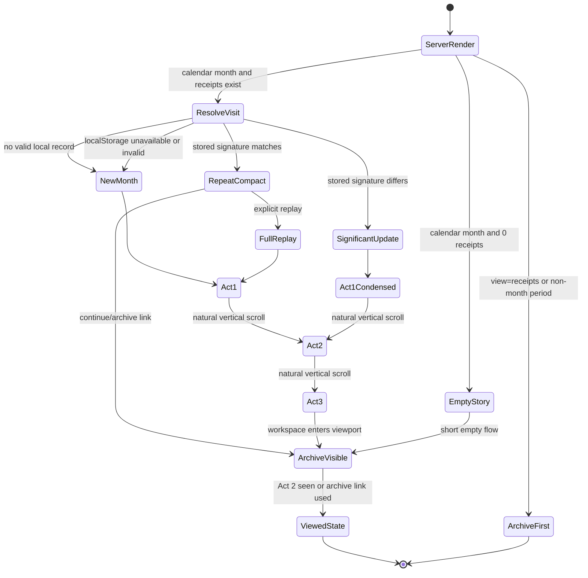

# Receipt Intelligence Home Story — implementation-ready specification

Date: 2026-07-21
Status: final design specification; application code unchanged

## 1. Decision

The default `/` page becomes a three-act, server-rendered story about the current calendar month. It is not an analytics overview. Its only jobs are:

1. show how real receipts form the month total;
2. explain that total with one deterministic, traceable insight;
3. hand the user into the existing receipt archive.

The full story ends before 2.5 viewport heights on desktop and before 2.8 viewport heights on mobile. The archive begins no later than the third viewport. Native vertical scrolling remains fully controlled by the user. There is no scroll lock, horizontal journey, parallax, 3D scene, particle field, dashboard grid, forecast scene, category scene, or data-quality scene.

The existing direct archive URL remains canonical:

`/?view=receipts&period=<period_key>`

It is linked from the first viewport and works without JavaScript.

## 2. Existing project inventory

### Routes and view

- Homepage route: `GET /`.
- Flask view: `index()` inside `init_routes(app)` in `app/web/routes.py`.
- Default query state: `period=current_month`, `view=overview`, empty `store_search`.
- Receipt detail: `GET /receipt/<int:receipt_id>`.
- Analytics workspace: `GET /analytics`; data endpoints `/analytics/data` and `/analytics/item_trend`.
- Import workspace: `GET|POST /upload`.
- Gmail import action: `POST /gmail/fetch`.
- Product workspace: `/item/<name>`, `/products/merge`, `/products/suggestions`, `/products/review`.
- Price-quality workspace: `/data-quality/prices`.

### Templates and shell

- Shared shell: `app/web/templates/base.html`.
- Homepage and archive: `app/web/templates/index.html`.
- `index.html` currently switches between overview and archive with `view == "receipts"`.
- The existing archive already supports receipt expansion, sorting, detail links, and an evidence drawer.

### CSS and JavaScript

- Global application stylesheet: `app/web/static/style.css`.
- Archived former stylesheet: `app/web/static/_archive/style_briefing_v1.css`; not active.
- A second file exists at `app/web/templates/static/style.css`; it is not loaded by `base.html` and must not be used.
- Bootstrap 5.3.2 CSS, Bootstrap Icons, and Bootstrap JS are loaded from jsDelivr by `base.html`.
- Homepage JavaScript is currently inline in `index.html`: briefing disclosure, archive sorting, receipt expansion, and drawer state.
- Analytics and item pages load Chart.js separately; the homepage does not need it.

### Data sources

- SQLite schema and connection: `app/db.py`.
- Receipts fields: `id`, `date`, `store`, `total`, `receipt_number`.
- Item evidence: `receipt_id`, names, quantity, price, `line_total`, category and source, normalized unit price/unit, price parsing source/confidence.
- Homepage aggregation: `app/dashboard_service.py` through `get_dashboard_data()`.
- Existing data blocks: period summary, comparable-period delta, daily trend, category deltas, five recent receipts, current-month summary, top products, action queue, and deterministic briefing.
- Full archive rows: `get_period_receipts()` and `_receipt_rows()`.

### Existing archive filters and import

- Period: `current_month`, `previous_month`, `last_30_days`, `all_time`.
- Store search: `store_search` GET parameter.
- Filter reset: direct archive URL without filter parameters.
- Import: `/upload`, with local PDF upload and Gmail fetch inside the existing import workspace.

## 3. Route behaviour and page modes

### Canonical behaviour

- `/` renders the story for `current_month` followed by the complete archive workspace in the same HTML document.
- `/?view=receipts&period=current_month` renders the archive-first mode without the story.
- `/?view=receipts&period=<any supported period>` keeps current archive behaviour.
- `/?period=previous_month` renders the story for the previous calendar month.
- `last_30_days` and `all_time` are not month stories. If requested without `view=receipts`, render archive-first mode.
- Period selection lives in the archive, not in the opening story.

### Server-rendered page contract

For story-eligible requests, the server renders:

- final readable state of all three acts;
- complete archive markup directly after Act 3;
- archive link in Act 1;
- replay control, initially hidden unless JavaScript is available;
- semantic receipt list and insight evidence independent of animation.

JavaScript only chooses visit mode and adds motion. It never creates core content or gates archive functionality.

## 4. Three-act scroll scenario

Progress values below are local to each act, from `0.00` to `1.00`. They are logical thresholds, not scroll-jacking positions. CSS sticky provides visual continuity. IntersectionObserver sentinels switch discrete states. The page never changes the user's scroll offset.

### Overall length: new monthly story

- Act 1: page position `0–0.95 viewport`.
- Act 2: `0.95–1.75 viewport`.
- Act 3: `1.75–2.40 viewport`.
- Archive workspace starts at approximately `2.35–2.45 viewport`.

The exact pixel length uses `dvh`, with a content-based minimum so large text never clips.

### Act 1 — receipts form the month

#### Initial state, progress 0.00–0.20

- Quiet month label and date range.
- Large but not yet dominant amount target, formatted in user locale.
- Timeline spans the visible month from day 1 to today or month end for a completed month.
- Real receipt markers are already present at their actual dates; selected receipts are subdued.
- First-viewport link: `Открыть архив чеков`.
- Compact label: `11 чеков · 1–20 июля` for current project data. Item-line count is not shown.

#### Intermediate A, progress 0.20–0.48

- Four to six selected receipt documents gain emphasis together, not one by one through the entire month.
- Each shows real receipt ID, receipt number, date, store, and total.
- Thin connectors bind each selected receipt to its actual timeline marker.
- Remaining receipts stay as quieter, data-bound ticks or daily groups.

#### Intermediate B, progress 0.48–0.78

- Selected receipt totals visually feed the month total.
- Other receipts are represented honestly as one or more grouped contributions, for example `ещё 6 чеков · 157,12 €`.
- A cumulative hairline advances across actual receipt dates. It is not a chart with axes, controls, tooltip, or legend; it is the visual accounting path into the total.
- The semantic amount is final from initial HTML. Motion uses masking, opacity, and transform; it does not repeatedly rewrite an aria-live number.

#### Final state, progress 0.78–1.00

- Total becomes the visual anchor: `287,82 €` in current data.
- Timeline, selected receipts, and quiet remainder stay visible as provenance.
- Copy: `Так сложился июль`.
- Nothing auto-advances. Scrolling continues naturally.

### Act 2 — one explanation

#### Initial state, progress 0.00–0.22

- Act 1 total remains visible at reduced scale as context.
- One neutral conclusion appears. No category list, comparison grid, chart set, forecast, or health badge.

Current-data example:

`Июль отличается двумя покупками одежды.`

#### Intermediate, progress 0.22–0.70

- One numerical confirmation appears:

`+45,98 € в категории — 88% общего изменения месяца.`

- One to three concrete evidence events appear below the sentence, not in cards:
  - receipt `#111`, number `2870-0110-7400-1892`, 2026-07-03, MAXIMA;
  - `Vīriešu gumijas apavi CROCS 42-47`, 25,99 €;
  - `Sieviešu čības CROCS 37,5-41,5`, 19,99 €.
- Evidence rows retain direct links to the receipt or relevant working section.

#### Final state, progress 0.70–1.00

- Conclusion, confirmation, and evidence are simultaneously readable.
- One contextual link appears: `Посмотреть одежду в аналитике`.
- Secondary link: `Открыть чек #111` when receipt evidence exists.
- The link target is generated by existing URL helpers and includes the selected period dates.

### Act 3 — handoff to archive

#### Initial state, progress 0.00–0.25

- Archive month heading and total target are already present in layout but visually subdued.
- The story total begins a shared-element transition to the archive heading.
- The semantic source and target remain separate in DOM. An `aria-hidden` visual clone performs the transform, preventing focus and reading-order problems.

#### Intermediate A, progress 0.25–0.55

- Application sidebar/navigation becomes visible.
- Archive month title, search, period filter, and import action gain normal working-interface contrast.
- Controls are interactive immediately; animation never blocks input.

#### Intermediate B, progress 0.55–0.80

- Timeline receipt events crossfade into spatial context for the first archive rows.
- Only selected receipt-level events participate. No item-row morphing.
- Archive rows are already server-rendered at final positions; visual clones supply continuity and disappear.

#### Final state, progress 0.80–1.00

- Story layer is inert and outside the focus path.
- Archive is a normal workspace with sidebar, month heading, total, search, filters, import, sort, expansion, drawer, and receipt links.
- URL may remain `/` while scrolling. Direct archive navigation uses `?view=receipts` and skips the story.

## 5. First and repeat visits

### Storage

Use `localStorage`. The project has no user/account model, so adding server persistence or a database table would create false multi-user semantics.

Key:

`receipt-intelligence:story:v1:<month_key>`

Value:

- `signature`: server-provided significant-story signature;
- `viewed_at`: ISO timestamp;
- `latest_receipt_id`: latest receipt included when viewed;
- `mode_version`: integer `1`.

Failure to access localStorage, private browsing restrictions, or invalid JSON falls back to the new-story static experience without breaking the page.

### Significant-story signature

The server supplies a deterministic short SHA-256 digest of:

- month key;
- chosen insight type;
- stable subject key, such as category or normalized product key;
- metric bucket: currency rounded to 5 € and percentages to 5 percentage points;
- sorted evidence receipt IDs;
- latest evidence receipt ID.

Small numerical drift within the same bucket does not create a new story. A new receipt matters only when it changes the chosen insight, bucket, or evidence set.

### Mode A — new monthly story

Condition: no valid local record for the month.

- Render full three-act length.
- Motion runs only as the user scrolls.
- Mark viewed when Act 2 final state reaches at least 60% viewport visibility or when the user follows the archive link.
- Do not mark viewed merely because HTML loaded.

### Mode B — new significant data

Condition: stored signature exists and differs from current signature.

- Opening label: `Месяц обновился`.
- Use condensed three-act length, maximum about 1.9 viewports before archive.
- Act 1 starts with the already formed timeline; only changed evidence receives emphasis.
- Act 2 is the dominant act and explains the new selected insight.
- Archive remains directly accessible.
- No forced autoplay and no forced restart at page top.

### Mode C — ordinary repeat visit

Condition: stored signature matches current signature.

- Default opening is a compact static summary no taller than 65dvh.
- It combines final Act 1 and final Act 2 states: month total, one conclusion, one confirmation, up to three evidence rows.
- Archive begins around the first viewport.
- Primary working link: `Продолжить в архиве`.
- Secondary action: `Повторить историю`.

`Повторить историю` changes only client presentation for the current visit, expands the full three acts, returns focus to the story heading, and scrolls to the story start only after explicit activation. It does not delete stored history.

## 6. Deterministic selection of one insight

### General selection rules

1. Build candidates from existing SQLite data only.
2. Reject each candidate that fails its quality gate.
3. Choose the eligible candidate with the lowest priority number.
4. Within one type, sort by descending impact ratio, then descending absolute amount, then stable subject key.
5. Return one insight and at most three evidence events.
6. If no candidate survives, return the calm-month fallback.
7. Never use LLM inference, generated causal language, or operational data-quality findings.

Language must use `совпало`, `связано`, `составило`, or `пришлось на`. Do not use `виновато`, `плохо`, `слишком много`, `неправильно`, `лишние траты`, or unsupported causal claims.

### Priority 1 — large or unusual purchase

Required data:

- valid current-month item `line_total` or valid receipt total;
- at least five comparable historical observations from the prior 90 days;
- receipt ID, number, date, store, total;
- item name when item-level evidence is used.

Quality gate:

- valid date and positive amount;
- item candidate: amount at least `max(40 €, 3 × historical median comparable item)`;
- receipt candidate: amount at least `max(100 €, 3 × historical median receipt)`;
- candidate is at least 25% of current-month spend or 50% of the absolute month delta;
- item candidate requires non-empty normalized/canonical/display name;
- historical median must contain at least five positive observations.

Priority: `1`.

Fallback: category movement candidate.

Neutral copy:

`На покупку «{name}» пришлось {amount}. Она заметно отличается от обычных покупок этого периода.`

Confirmation:

`{share}% расходов месяца` or `{share}% общего изменения`.

Destination: receipt detail for receipt-level evidence; item profile for item-level evidence.

### Priority 2 — category explains the month change

Required data:

- comparable current and previous windows;
- total spend delta;
- item-level category and `line_total`/price;
- 1–3 largest current evidence items with receipt metadata.

Quality gate:

- at least three receipts in each comparable window;
- total spend change is at least `max(10 €, 10% of previous spend)`;
- at least 80% of receipt spend in both windows is covered by positive item amounts;
- no more than 30% of item spend belongs to `прочее`;
- category delta has the same sign as total delta;
- absolute category delta is at least `max(10 €, 40% of absolute total delta)`;
- contribution ratio shown to the user is capped at 100% to avoid confusing overshoot from offsetting categories.

Priority: `2`.

Fallback: visit-frequency candidate.

Neutral copy:

`{Month} отличается расходами в категории «{category}».`

Confirmation:

`{signed_category_delta} — {contribution}% общего изменения месяца.`

Destination: `/analytics` with existing start/end/category query parameters.

Current project result:

- month spend: 287,82 € across 11 receipts;
- previous comparable spend: 235,41 € across 13 receipts;
- total delta: +52,41 €, +22,3%;
- clothing delta: +45,98 €, about 88% of total delta;
- evidence: two CROCS lines worth 25,99 € and 19,99 € in receipt #111.

This candidate wins unless a Priority 1 candidate passes its stricter gate.

### Priority 3 — visit frequency

Required data:

- receipt counts for equal current and previous windows;
- receipt dates and totals;
- total spend delta and previous average receipt total.

Quality gate:

- at least seven elapsed days in both windows;
- at least five combined receipts;
- visit-count difference is at least three and at least 40% of previous count;
- direction of visit change matches direction of spend change;
- estimated frequency contribution `abs(visit_delta × previous_average_receipt)` is at least 40% of absolute spend delta.

Priority: `3`.

Fallback: normalized-price candidate.

Neutral copy:

`В этом месяце изменился ритм покупок.`

Confirmation:

`{current_count} чеков вместо {previous_count}; это совпало с изменением расходов на {delta}.`

Evidence: up to three representative receipt dates/visits. Destination: filtered archive.

### Priority 4 — normalized price change

Required data:

- stable normalized/canonical product key;
- identical supported normalized price unit;
- current observation and at least two prior observations from the previous 180 days;
- parse confidence, receipt and item metadata.

Quality gate:

- every displayed observation has `price_parse_confidence >= 0.85`;
- normalized unit is identical and belongs to the existing supported set;
- every normalized price is positive and at most 10,000;
- median prior price exists from at least two observations;
- absolute price change is at least 15%;
- product accounts for at least 10% of current month spend or estimated monthly effect is at least 3 €;
- no conflicting product category group.

Priority: `4`.

Fallback: calm month.

Neutral copy:

`У «{product}» изменилась сопоставимая цена.`

Confirmation:

`{current_price} {unit}, {signed_percent}% к медиане предыдущих покупок.`

Destination: existing item profile. Current Ariel change of +3.4% does not qualify.

### Priority 5 — calm or still-forming month

Required data: current summary and optional comparison.

Quality gate: always available.

Priority: `5`.

Fallback variants:

- no receipts: `В {month} пока нет чеков.`
- receipts but no baseline: `{Month} только начинает формироваться.`
- valid comparison without eligible signal: `{Month} проходит без заметных отклонений.`

Confirmation:

- no receipts: no numerical claim beyond `0 чеков`;
- no baseline: `{count} чеков на сумму {spend}`;
- calm comparison: `Изменение {signed_delta}, ниже порога значимости.`

Destination: import for no receipts; archive otherwise.

## 7. Act 1 visual model

### Desktop

- One editorial canvas, not a set of cards.
- Timeline occupies the lower third of the viewport.
- Month label sits top-left; archive link top-right.
- Total occupies the visual centre/right.
- Selected receipt documents are flat, paper-like planes with minimal borders. No perspective or simulated depth.
- Date positions are exact. Horizontal spacing may be collision-adjusted vertically, but the connector must return to the exact date marker.
- Receipt numbers use tabular/monospaced figures. Stores and dates use existing application typography.
- Only one muted accent identifies the selected insight evidence. Red remains reserved for real errors in the working interface.

### Receipt selection

Build a deterministic selected set of at most six receipts:

1. all receipts referenced by the chosen insight, up to three;
2. largest receipt by total;
3. latest receipt;
4. earliest receipt;
5. fill remaining slots with receipts nearest chronological quartiles;
6. deduplicate by receipt ID;
7. stable final order by date, then ID.

This set is traceable and does not change randomly between renders.

### Data-count states

#### 0 receipts

- Empty month timeline with today marker.
- Copy: `В июле пока нет чеков.`
- Primary action: `Импортировать первый чек`.
- Act 2 becomes a short explanatory state, not an invented insight.
- Archive begins before the second viewport.

#### 1–3 receipts

- Show all receipts as selected documents.
- No quiet remainder group.
- Copy acknowledges the month is still forming.
- Total is exact; comparison claims require the normal quality gates.

#### 4–15 receipts

- Highlight four to six deterministic receipts.
- Render every other receipt as a quiet date-bound tick.
- Group remainder label gives exact receipt count and exact summed amount.

#### More than 15 receipts

- Highlight six receipts on desktop and four on mobile.
- Up to 60 remaining receipts render as individual date ticks.
- Beyond 60, aggregate by calendar day into one marker with count and summed total.
- The story DOM budget is at most 66 receipt/event elements, regardless of archive size.

#### Mobile

- Timeline becomes vertical and follows calendar order top-to-bottom.
- Four selected receipts use compact rows, not miniature paper cards.
- The total remains above the timeline and never moves off-screen horizontally.
- No horizontal scrolling or swipe-only interaction.
- Long store and receipt numbers wrap or truncate with an accessible full value.

#### Reduced motion

- Disable sticky choreography, clones, transforms, count masks, smooth scrolling, and stagger.
- Render the final state of each act as normal document flow.
- Timeline, amount, insight, evidence, links, and archive remain complete.
- Archive begins by approximately the second viewport.

## 8. Act 2 composition

The composition has one vertical reading axis:

1. small context label;
2. one large conclusion, maximum two lines desktop and three lines mobile when possible;
3. one numerical confirmation;
4. one to three evidence rows;
5. one primary contextual link and optional receipt-detail link.

There are no bordered KPI cards. Evidence rows are separated by spacing and hairlines. They use real item/receipt labels, exact amounts, and dates. Color may highlight the shared evidence subject, but meaning is repeated in text.

If the calm story has no evidence, the space collapses. Empty placeholders are forbidden.

## 9. Shared-element handoff

### Visual continuity

- The story total and archive total share the same formatted string and data key.
- At the Act 3 threshold, JavaScript reads source and target rectangles once.
- An `aria-hidden` clone animates with Web Animations API using only `transform` and `opacity` for at most 360 ms.
- Source and target crossfade around the clone. The real archive target is present throughout.
- Animation is interruptible. Fast scrolling immediately resolves to the destination state.

### Receipt continuity

- At most three selected receipt event clones crossfade toward matching archive rows by `data-receipt-id`.
- No item line, category, badge, drawer, or status field morphs.
- If a matching archive row is outside the rendered/visible range, skip that clone.

### Working interface reveal

- Sidebar/navigation, archive header, search, period filter, and import appear through opacity and small translation only.
- Controls never use `display:none` after they become focusable.
- Direct archive mode has no reveal classes and is immediately complete.
- Archive sorting, expansion, drawer, search, period changes, and import do not call or depend on story JavaScript.

## 10. Minimal implementation architecture

### View model additions

Add `dashboard["month_story"]` with this stable contract:

- `eligible`: whether selected period is a calendar-month story;
- `month_key`, localized `month_label`, date range;
- `total`, `receipt_count`;
- `timeline_events`: selected and quiet/aggregated receipt events;
- `selected_receipts`: 0–6 receipt dictionaries containing all required real identifiers;
- `remainder_count`, `remainder_total`;
- `insight`: type, priority, subject key, neutral title, confirmation, metric values, destination URL;
- `evidence`: 0–3 receipt/item events with destination URLs;
- `signature`, `latest_receipt_id`;
- `empty_state` when applicable.

Keep raw calculations numeric until template formatting. Do not preformat currency inside SQL.

### Service boundary

Add focused helpers in `app/dashboard_service.py`:

- build candidate inputs with batched SQLite queries;
- apply quality gates;
- rank one candidate deterministically;
- select receipt evidence;
- build timeline groups;
- calculate signature;
- assemble `month_story`.

Keep existing `build_briefing()` during this iteration to avoid unrelated regression. The new homepage stops rendering it. Removal can happen only after tests and all consumers confirm it is unused.

### Route

`index()` loads period receipts for both story and archive-first modes because the archive is present below the story. It passes one archive collection and one story view model to the template. Do not add a JSON API for initial rendering.

### Templates

- Add `head` and `body_class` extension blocks to `base.html`.
- Extract current archive workspace into `_receipt_workspace.html` so overview and direct archive render the same implementation once.
- Rewrite the overview portion of `index.html` into the three acts and include the archive partial afterward.
- Include story CSS and deferred story JavaScript only for story-eligible overview requests.

### CSS

- Keep existing archive/application styles in `style.css`.
- Add a route-scoped `home-story.css` for narrative layout, sticky states, visit-mode compression, Act 3 shell reveal, mobile, print, and reduced motion.
- Do not add raw page-specific overrides to the global file unless an existing archive selector must change.

### JavaScript

Add one deferred ES module: `app/web/static/home-story.js`.

Responsibilities:

- resolve localStorage visit mode;
- set a single mode attribute on the story root;
- observe act sentinels with IntersectionObserver;
- trigger discrete CSS/WAAPI state transitions;
- run the limited shared-element clone transition;
- implement `Повторить историю`;
- persist viewed signature;
- expose no archive business logic.

Move existing inline archive sort/expand/drawer logic to `app/web/static/receipt-workspace.js` and load it once. The archive now renders in two page modes, so leaving behaviour inline would risk duplicate binding. This is a mechanical move with no behaviour change.

### Animation technology

No new animation dependency.

- CSS: sticky layout, opacity/transform state styling, reduced-motion overrides.
- IntersectionObserver: act and sentinel activation.
- Web Animations API: amount and up to three receipt clone transitions.
- No GSAP, ScrollTrigger, canvas, WebGL, continuous parallax, or third-party motion package.

## 11. Performance and degradation

### Budget

- Added story JavaScript: target at most 10 KB gzip.
- Added story CSS: target at most 15 KB gzip.
- New image/font requests: zero.
- Story event DOM: maximum 66 event elements plus six selected receipt elements.
- Largest Contentful Paint: under 2.5 s on a mid-tier mobile profile with local server data.
- Cumulative Layout Shift: under 0.1.
- Interaction to Next Paint: under 200 ms.
- Animation work: under 16 ms per frame; target under 8 ms for story work.
- Shared transition measures layout once per transition, then animates transforms only.

### Avoiding degradation

- No per-frame scroll handler is required.
- If future tuning needs continuous progress, one passive scroll listener with `requestAnimationFrame` may update one CSS custom property; it must not query layout inside the frame loop.
- Batch insight SQL. Do not query per receipt or per item.
- Reuse `_receipt_rows()` results where possible.
- Reserve layout dimensions before motion to avoid reflow.
- Cancel active WAAPI animations when act state changes or page becomes hidden.

### No JavaScript

- `html` never receives the enhancement class.
- All story acts render in their final readable states in normal flow.
- Sidebar and archive controls remain visible.
- Direct archive, receipt, analytics, filter, search, and import links work.
- Replay control stays hidden.
- No content relies on client-generated text.

## 12. Accessibility requirements

- WCAG AA contrast: 4.5:1 normal text, 3:1 large text and meaningful graphics.
- Keyboard focus order follows DOM reading order, not visual animation order.
- Visible 2–4 px focus indicator on every action.
- Touch targets at least 44×44 CSS px with at least 8 px separation.
- Sequential headings: one page `h1`, act headings `h2`, evidence labels below them.
- Timeline is a semantic list. Each selected receipt has a complete accessible label containing ID, date, store, and total.
- Visual clones are `aria-hidden` and never focusable.
- Scroll state is not announced through `aria-live`; this prevents noisy screen-reader updates.
- Numerical meaning never depends on color alone.
- `prefers-reduced-motion: reduce` produces static layout and disables smooth scrolling.
- Browser zoom to 200% must not hide archive access or controls.
- Skip link remains functional. Add a second first-viewport link to the archive workspace.
- Focus never moves because of scrolling. Focus moves to the story heading only after explicit replay activation.
- Locale-aware dates and currency appear visually; machine-readable dates retain ISO `datetime` values.

## 13. Responsive behaviour

### 1440 px and above

- Spacious editorial canvas, maximum readable content width.
- Horizontal month timeline.
- Five or six selected receipts.
- Archive sidebar reveals during Act 3.

### 1024–1439 px

- Same narrative model with reduced offsets.
- Four or five selected receipts.
- No overlapping text and receipt documents.

### 768–1023 px

- Timeline may remain horizontal if labels fit; otherwise use vertical layout.
- Navigation uses existing collapsed behaviour.
- Act 3 reveal cannot cover search/filter controls.

### 375–767 px

- Vertical timeline.
- Four compact selected receipt rows.
- One-column insight composition.
- Evidence names wrap; amounts remain tabular and aligned.
- Archive controls stack in task order: search, period, import, active filters.
- No horizontal overflow at 320 px minimum supported width.

### Landscape mobile

- Disable sticky positioning when viewport height is below 500 px.
- Render compact normal-flow acts to prevent clipped content.

## 14. Text wireframes

### Desktop — new monthly story

```text
┌──────────────────────────────────────────────────────────────────────────────┐
│ Receipt Intelligence                                  Открыть архив чеков ↗ │
│                                                                              │
│ ИЮЛЬ 2026                         [ 287,82 € ]                               │
│ 11 чеков · 1–20 июля                                                       │
│                                                                              │
│   ┌─ #111 · 03.07 · MAXIMA ─ 63,72 € ─┐                                    │
│              ┌─ #358 · 05.07 · MAXIMA ─ 49,00 € ─┐                         │
│                                  ┌─ #364 · 20.07 · MAXIMA ─ 10,00 € ─┐      │
│  01 ──●──●────●────●──●────●────●────●────●──●──●── 21                    │
│       реальные даты чеков        ещё 8 чеков · 165,10 €                    │
│                                                                              │
│                         Так сложился июль                                   │
└──────────────────────────────────────────────────────────────────────────────┘

┌──────────────────────────────────────────────────────────────────────────────┐
│ ГЛАВНОЕ В ИЮЛЕ                                      287,82 €                │
│                                                                              │
│ Июль отличается двумя покупками одежды.                                    │
│ +45,98 € — 88% общего изменения месяца.                                    │
│                                                                              │
│ 03.07  MAXIMA  #111                                                         │
│ Vīriešu gumijas apavi CROCS 42–47                         25,99 €           │
│ Sieviešu čības CROCS 37,5–41,5                           19,99 €           │
│                                                                              │
│ Посмотреть одежду в аналитике ↗       Открыть чек #111 ↗                   │
└──────────────────────────────────────────────────────────────────────────────┘

┌───────────────┬──────────────────────────────────────────────────────────────┐
│ НАВИГАЦИЯ     │ Июль 2026                                  287,82 €         │
│ Чеки          │ [Поиск по магазину…] [Период ▾] [Импортировать]            │
│ Аналитика     │                                                              │
│ Операции      │ Все чеки                                      11 найдено   │
│               │ MAXIMA   20.07.2026   #364              10,00 €            │
│               │ RIMI     17.07.2026   #365               7,76 €            │
│               │ MAXIMA   15.07.2026   #363              12,00 €            │
└───────────────┴──────────────────────────────────────────────────────────────┘
```

### Desktop — repeat visit

```text
┌──────────────────────────────────────────────────────────────────────────────┐
│ Июль 2026                                              Открыть архив чеков ↗│
│ 287,82 €                                                                    │
│ Июль отличается двумя покупками одежды.  +45,98 €                           │
│ [Продолжить в архиве]  [Повторить историю]                                  │
├──────────────────────────────────────────────────────────────────────────────┤
│ Archive workspace begins around first viewport                             │
└──────────────────────────────────────────────────────────────────────────────┘
```

### Mobile — new monthly story

```text
┌──────────────────────────────┐
│ ИЮЛЬ 2026                    │
│ 11 чеков · 1–20 июля         │
│                              │
│ 287,82 €                     │
│                              │
│ ● 03.07                      │
│   MAXIMA · #111              │
│   63,72 €                    │
│ │                            │
│ ● 05.07                      │
│   MAXIMA · #358 · 49,00 €    │
│ │                            │
│ ● 20.07                      │
│   MAXIMA · #364 · 10,00 €    │
│ │ ещё 8 чеков · 165,10 €     │
│                              │
│ Открыть архив чеков ↗        │
└──────────────────────────────┘

┌──────────────────────────────┐
│ ГЛАВНОЕ В ИЮЛЕ               │
│                              │
│ Июль отличается двумя        │
│ покупками одежды.            │
│                              │
│ +45,98 €                     │
│ 88% общего изменения         │
│                              │
│ 03.07 · MAXIMA · #111        │
│ CROCS 42–47          25,99 € │
│ CROCS 37,5–41,5      19,99 € │
│                              │
│ Открыть аналитику ↗          │
└──────────────────────────────┘

┌──────────────────────────────┐
│ Июль 2026          287,82 €  │
│ [Поиск по магазину…]         │
│ [Текущий месяц ▾]            │
│ [Импортировать]              │
│                              │
│ MAXIMA · 20.07       10,00 € │
│ RIMI   · 17.07        7,76 € │
│ MAXIMA · 15.07       12,00 € │
└──────────────────────────────┘
```

## 15. State diagram



## 16. Risks and mitigations

### Technical risks

- Large archive HTML can dominate page size. Keep story DOM capped; preserve current archive rendering initially, then measure before considering pagination.
- LocalStorage can fail. Treat it as optional enhancement.
- Shared-element geometry can change during responsive reflow. Measure only at transition start, cancel on resize, and resolve to final state.
- Current style sheet is large and page selectors may collide. Scope every story rule under one root/body class in a separate file.
- Existing inline archive JavaScript could bind twice after template extraction. Move it to one deferred module and load once.
- Invalid receipt dates exist in schema. Exclude invalid dates from timeline candidates but keep them accessible in archive.
- Item/category sums may not equal receipt totals. Enforce coverage gates and never claim category explanation below threshold.

### UX risks

- Repeat users may perceive story as a delay. Repeat mode starts compact and archive-first.
- Negative financial language may feel judgmental. Use neutral templates only.
- Weak data can create a theatrical empty experience. Collapse acts and lead to import/archive.
- Story may still resemble a dashboard if multiple metrics accumulate. Enforce one conclusion and one confirmation in template contract.
- Sticky sections can feel trapped. Keep them short, disable in low-height and reduced-motion contexts, and never intercept wheel/touch input.

## 17. Acceptance criteria

### Product

- Default `/` tells one month story in three acts.
- Archive link is keyboard- and touch-accessible in first viewport.
- Archive begins no later than approximately the third viewport in full mode and around the first viewport in repeat mode.
- No mandatory category, price, forecast, or data-quality scene exists.
- One insight, one confirmation, and no more than three evidence events render.
- Current dataset selects the clothing explanation unless a Priority 1 candidate objectively passes.

### Functional

- Direct archive URL and all existing archive filters, search, sort, expansion, drawer, receipt links, and import remain functional.
- Story works for 0, 1–3, 4–15, and large receipt counts.
- Replay is explicit and does not erase stored state.
- Significant updates are signature-driven, not triggered by every small amount change.
- JavaScript failure leaves full readable content and working archive.

### Quality

- No scroll lock, horizontal scroll, 3D, particles, continuous parallax, or new animation dependency.
- Reduced-motion path contains no sticky choreography or shared clones.
- Keyboard, screen reader, 200% zoom, 375 px portrait, mobile landscape, 768 px, 1024 px, and 1440 px are verified.
- Performance budget in section 11 passes.
- Existing test suite passes and new deterministic-selector/route tests pass.

## 18. Exact application files planned for change

1. `app/dashboard_service.py` — month-story queries, quality gates, ranking, evidence selection, timeline groups, signature, view model.
2. `app/web/routes.py` — story eligibility and shared archive data loading.
3. `app/web/templates/base.html` — additive `head` and `body_class` blocks for route-scoped enhancement.
4. `app/web/templates/index.html` — three acts, direct/compact modes, archive include, removal of old dispatch rendering.
5. `app/web/templates/_receipt_workspace.html` — new partial extracted from existing archive markup.
6. `app/web/static/home-story.css` — new scoped narrative, responsive, print, and reduced-motion styles.
7. `app/web/static/home-story.js` — new visit-state, observers, replay, and shared-element module.
8. `app/web/static/receipt-workspace.js` — extracted existing archive sort/expand/drawer behaviour; no intended feature change.
9. `app/web/static/style.css` — only selectors required to align the archive heading/controls with the Act 3 target; no new story system here.
10. `tests/test_dashboard.py` — selector priority, gates, fallback, receipt sampling, signature stability, current data contract.
11. `tests/test_ui_shell.py` — route modes, semantic story/archive structure, asset loading, no-JS and reduced-motion contracts.

No database migration, new route, API, package, external font, animation library, account model, or AI infrastructure is required.

## 19. Sequential implementation plan

### Stage 1 — freeze current behaviour

- Add/adjust tests documenting existing `/`, archive query parameters, import links, archive sorting/expansion markup, and current dashboard data.
- Run focused dashboard and UI-shell tests.
- Checkpoint: no visible change; baseline green.

### Stage 2 — deterministic story model

- Add batched data queries and candidate builders.
- Implement quality gates and fixed priority selection.
- Add receipt selection, timeline aggregation, and signature.
- Test each insight type, tie-break, zero data, invalid dates, low coverage, low confidence, and signature bucketing.
- Checkpoint: `month_story` is inspectable in tests; templates unchanged.

### Stage 3 — archive extraction

- Extract archive markup into `_receipt_workspace.html` without visual changes.
- Move archive inline behaviour to `receipt-workspace.js` and load it once.
- Render same partial in direct archive mode.
- Checkpoint: screenshot/DOM parity for existing archive; all archive tests green.

### Stage 4 — static three-act document

- Add template blocks in `base.html`.
- Replace old dispatch overview with semantic Act 1–3 markup.
- Include complete archive below Act 3.
- Add direct archive and contextual evidence links.
- Verify with JavaScript disabled before adding motion.
- Checkpoint: correct reading order, all data real, archive before third viewport in target sizes.

### Stage 5 — layout and responsive styling

- Add scoped `home-story.css`.
- Implement desktop horizontal and mobile vertical timelines.
- Add data-count, empty, compact-repeat, low-height, print, and reduced-motion layouts.
- Checkpoint: 375/768/1024/1440 screenshots; no overflow or clipped controls.

### Stage 6 — visit modes and discrete motion

- Add localStorage resolver, mode attribute, sentinels, IntersectionObserver, and replay.
- Persist only after meaningful viewing or archive action.
- Verify new month, changed signature, same signature, corrupt storage, and unavailable storage.
- Checkpoint: no forced animation on repeat visit; replay works by keyboard.

### Stage 7 — shared-element handoff

- Add amount clone transition and at most three receipt clones.
- Make transitions interruptible and cancel on resize/visibility changes.
- Verify direct archive mode has zero dependency on story module.
- Checkpoint: no layout shift, no blocked input, reduced-motion path static.

### Stage 8 — quality gate

- Run full automated tests.
- Audit keyboard, screen reader reading order, focus, contrast, 200% zoom, reduced motion, no-JS, mobile landscape.
- Measure LCP, CLS, INP, asset size, DOM count, and animation frame cost.
- Confirm current July data produces one clothing insight and does not elevate Ariel +3.4%.
- Checkpoint: every acceptance criterion passes before implementation is considered complete.
